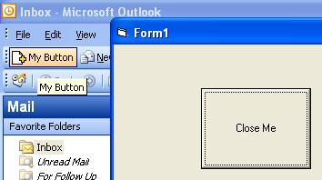



## An Outlook Command Bar Button

### Description

This project is to show you a quick (and easy to understand) method to create an Office plugin (In this case Outlook). This will place a button in your outlook toolbar (the New/Print/Reply/Send&amp;Recieve bar AKA 'Standard').
 
### More Info
 

             |
---                |---
**Submitted On**   |2005-11-30 18:48:58
**By**             |[Eli P](https://github.com/Planet-Source-Code/PSCIndex/blob/master/ByAuthor/eli-p.md)
**Level**          |Intermediate
**User Rating**    |3.8 (15 globes from 4 users)
**Compatibility**  |VB 6\.0
**Category**       |[OLE/ COM/ DCOM/ Active\-X](https://github.com/Planet-Source-Code/PSCIndex/blob/master/ByCategory/ole-com-dcom-active-x__1-29.md)
**World**          |[Visual Basic](https://github.com/Planet-Source-Code/PSCIndex/blob/master/ByWorld/visual-basic.md)
**Archive File**   |[An\_Outlook19526611302005\.zip](https://github.com/Planet-Source-Code/eli-p-an-outlook-command-bar-button__1-63439/archive/master.zip)

